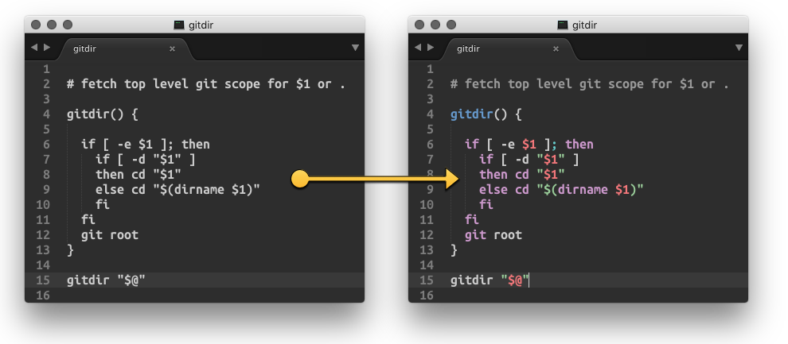

GuessSyntax Sublime Text 2/3 Plugin
------------------------------

You're a computer, dummie.. Figure it out!
==========================================

This is a small plugin for Sublime Text 2 and 3 that allows automatic syntax detection on open/save of ANY document.

The plugin can be automatically invoked *on save* or by a keyboard shortcut (todo).

**Note**::

    ** coffee-script, node, and npm module "language-detect" need to be installed!!! **

	Also, it is expected that your `coffee` executable will be at `/usr/local/bin/coffee`

Latest changes
==============

**2015-11-25**

First commit.

Configuration
=============

Commands & Keyboard Shortcuts
=============================

**Run**

The plugin can be invoked by a keyboard shortcut:

* **OS X**: ``Command+Alt+z``
* **Linux, Windows**: ``Control+Alt+z``

**Add pylint ignore comment/statement**

Add a 'Pylint disable' comment to the end of the line with an error code in it,
so it will be ignored on the next check.

* **OS X**: ``Command+Alt+i``
* **Linux, Windows**: ``Control+Alt+i``

**Toggle Marking**

The marking of the errors in the file can be toggled off and on:

* **OS X**: ``Command+Alt+x``
* **Linux, Windows**: ``Control+Alt+x``

**Quick List**

To see a quick list of all the Pylint errors use:

* **OS X**: ``Command+Alt+c``
* **Linux, Windows**: ``Control+Alt+c``

.. _gist: https://gist.github.com/3646966
.. _Yusuke Kamiyamane: http://p.yusukekamiyamane.com/
